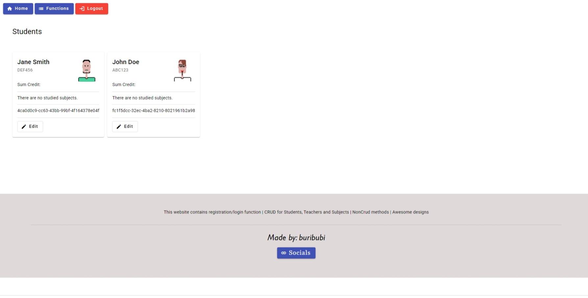

# Full Stack Angular + ASP.NET Application

Ez az alkalmazás egy teljeskörű full stack webalkalmazás, amely Angular frontendből és ASP.NET backendből áll. Az alkalmazás célja a diákok, tanárok és tantárgyak kezelésének megkönnyítése.

## Főbb funkciók
- Felhasználói regisztráció és bejelentkezés
- Diákok, tanárok és tantárgyak listázása
- Új diákok, tanárok és tantárgyak létrehozása
- Diákok és tantárgyak összekapcsolása

## Frontend (Angular)
A frontend egy Angular alapú SPA (Single Page Application), amely az alábbi oldalakat tartalmazza:

 **Home oldal**  
  
 **Regisztrációs oldal**  
  
 **Bejelentkezés oldal**  
  
 **Diákok listázása**  
  
 **Tantárgyak listázása**  
  
 **Tanárok listázása**  
  
 **Home oldal mobil nézet**  
  
 **Funkció lista**  
  

A navigációs menüben elérhető opciók alapján a felhasználók könnyen kezelhetik az adatokat.

## Backend (ASP.NET)
A backend egy ASP.NET alapú API, amely a következő szolgáltatásokat biztosítja:

- Felhasználókezelés (regisztráció, bejelentkezés, jogosultságkezelés)
- CRUD műveletek diákokra, tantárgyakra és tanárokra
- Diákok és tantárgyak közötti kapcsolatok kezelése
- Swagger dokumentáció (`swagger.json` fájlban elérhető API dokumentáció)

A backend és a frontend között REST API kommunikáció zajlik.

## Telepítés és futtatás
1. **Backend:**
   - Nyisd meg az ASP.NET projektet Visual Studio-ban
   - Nyisd meg a **NuGet Package Manager Console**-t, és futtasd a következő parancsot:
     ```
     Update-Database
     ```
   - Futtasd az alkalmazást (`dotnet run` vagy Visual Studio-ból indítva)
   - Az API elérhető lesz a megadott localhost címen

2. **Frontend:**
   - Nyisd meg a frontend projektet
   - Telepítsd a függőségeket: `npm install`
   - Indítsd el az alkalmazást: `ng serve`
   - A frontend elérhető lesz a böngészőben a `http://localhost:4200` címen